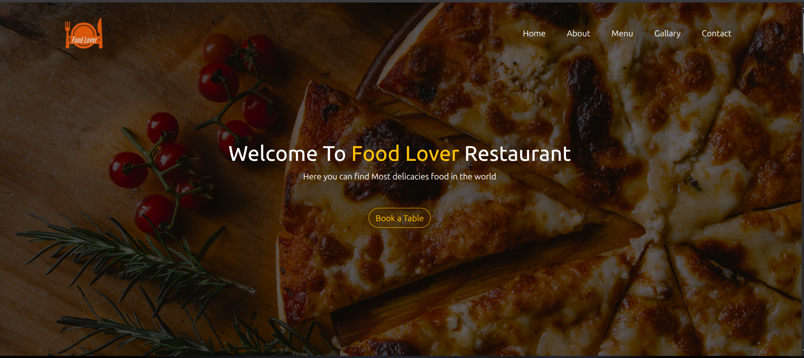

# 🍽️ Food Lover Restaurant Template

A responsive restaurant landing page template built using HTML, CSS, and Bootstrap.

This project was created as a practice to improve my front-end development skills and understanding of responsive web design.

---

## 📌 Live Preview
You can run the project by opening:

or using Live Server in VS Code.

---

## 🚀 Features

- Responsive design for all screens
- Modern restaurant UI
- Hero section with background image overlay
- About section
- Offers section
- Menu section with prices
- Food gallery
- Contact form
- Footer

---

## 🛠️ Built With

- HTML5
- CSS3
- Bootstrap 5
- Font Awesome

---

## 📸 Preview

---

## 🎯 What I Learned

- Bootstrap grid system
- Responsive layout design
- Flexbox & positioning
- UI structuring
- Styling real-world landing pages

---

## 👨‍💻 Author

Made by Ahmed Essam
